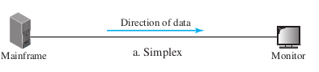
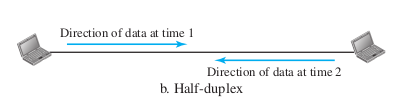
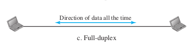

# Data flow

Data flow between two devices can be simplex, half-duplex, full-duplex

**1. Simplex** :- In simplex mode the communication is unidirectional, i.e., only one device of the two on the link can tranmit the data, other can only recieve. 

e.g, keybord, monitors etc.

**2. Half-Duplex** :- In half-duplex mode both devices can send or receive data but not at the same time i.e.,  when one device is sending, other can only recive and vice versa.

e.g, Walkie-talkie radios etc.

**3. Full-duplex** :- In full duplex mode both devices can transmit and recive data simultaneouly.

e.g, Telephone networks, etc.

