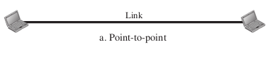
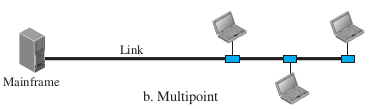
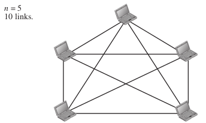
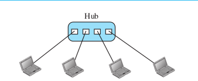
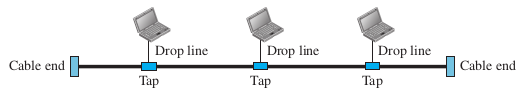
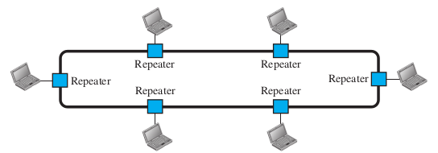
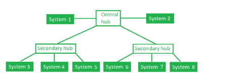
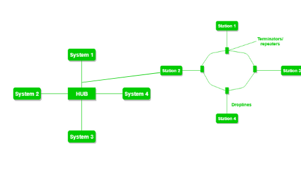

# physical structure/ Topology

Physical structure in a network is the way in which a network in connected to each other.

**Type of connections**

**1. Point to Point** :- A point-to-point connection provide a dedicated link betwwn two devices. The entire capacity of the link is reserverd for the transmission between two devices.

typically point-to-point uses actual length of wire or cable, wireless connecetion is also possible.

e.g., signal from a tv remove is a point-to-point connection using infrared light spectrum.

**2. Multipoint** :- In multipoint (multidrop) connection more than two specific devices share a single link. The capacity of the channel is shared spatially.

(if several devices can use the link simultaneously, it is spatially separated. If users must take turn, it is timeshared connection.)

## Network Topology

Topology refers to the way in which a network is laid out physically. Two or more devices connects to a link; two or more links forms topology.

Topology refers to way in which network components are interconnected to each other. There are two type of network topology : physical and logical topology.

The physical topology is the geometric representation of all the nodes in a network.

There are 6 basic topologies.

**1. Mesh Topology** :- In mesh topology, every device is connected to every other device via a dedicated channel. These chnnels are known as links. The protocols uses are AHCP (Ad Hoc Configuration Protocols), DHCP (Dynamic Host Configuration Protocol) etc.

*If there are N nodes in a network. Node 1 must be connected to N-1 nodes, Node 2 must be connected to N-1 nodes, similarly N Nodes must be connected to N-1 nodes. Hence we need N physical links to  connect N-1 nodes, i.e., (N*(N-1))*

Number of I/O ports at each node = N-1

Number of cables in mesh topology = (N*(N-1))

Duplex communication = (N*N(N-1)/2)

Example of mesh topology is regional telephone network. where each telephone network is connected to other telephone network. Internet is also an example of mesh topology.

**Advantages of mesh topology**

* Any link breakdown will not affect the communication between connected devices.

* communication is very fast between nodes.

* Point-to-point connection makes fault detection and fault isolation easy.

* Physical boundries prevent unauthorised access, making it secure and private.

**Diadvantages of mesh topology**

* The cost of cables is high as bulk of cabling or wiring is required, hence only suitable for less number of devices.

* mesh networks are very large hence cost of maintainance and management is very high. And installation and reconnection is difficult.

* redudant connection are high that reduces the efficency of the network.

------------------------
-----------------------

**2. Star Topology** :- In star topology each device has a dedecated point-to-point connection only with a central controller, also known as a hub. 

The hub acts as an exchange: if one device want to send data to another, it sends data to the hub, which then relays the data to other connected devices. (i.e., The devices are not directly connected to each other.)

The hub can be passive in nature (not a intelligent hub such as broadcasting devices), or an active hub (a intelligent hub), active hub have repeaters in them.

Coaxial cable or RJ-45 cables are used to connect devices. It also uses Ethernet protocols such as CSMA/CD (carrier sensing multiple access/collision detection).

It is the most popular topology in network implementation.

*if N devices are connected to each other in star topology then the number of cable required to connect them is N. And the number of port required by each device is 1 i.e, to connect to the hub.*

Number of cables required = N

Number of ports at each device = 1

High speed LAN's often uses star topology.

**Advantages of star topology**

* Star topology is cost effective as it uses inexpensive coaxial cable

* if one link fails, only that link is affected. All other remains active.

* Easy to fault identification and fault isolation, as long as hub is working.

* Easy to install and reconfigure, as addition, deletion or moves involve only one connection: between the device and the hub.

**Disadvantages of star topology**

* Single point of failure the hub, if the cetral hub goes down, whole system goes down.

* The cost of installation is high

* Perfomance is based on the central hub.

------------------------------------
------------------------------------

**3. Bus Topology** :- Bus topology is a mulitpoint connection and non-robust topology. One long cable acts as a network backbone, to link all the devices in the network.

Nodes are connected to the backbone cable by drop lines and tap. 

A drop line is connection running between the device and main cable. A tap is a connector that splices into the main cable to create a connection with metallic ore.

*If N devices are connected to each other in a bus topology then the nubmber of cables required to connect them is 1 (i.e, backbone cable), and N drop line (for each node).*

It is mainly used in early ethernet LANs (802.3), and cable television networks. The most common access method is CSMA (carrier sense multiple access) 

**Advantages of bus topology**

* the cost of cable is less compared to other topologies, but only uses to buid small networks.

* familiar technology as installation and troubleshooting are well known.

* coaxial or twisted-pair cables are mainly used, that supports upto 10 Mbps.

* a failure in one node will not affect other nodes.

**Disadvantages of bus topology**

* Difficult reconnection and fault isolation

* signal reflection at the taps causes degradation in quality. (Can be controlled by limiting the number and spacing between the devices connected)

* if backbone cable fails, whole system will crash.

* security is very low.

* If the network traffic is high, than collision increase in the network. (Various protocols are used in MAC layer such a pure ALOHA, CSMA/CD etc, to avoid cogestion)

-------------------------------------
-----------------------------------------

**4. Ring Topology** :- In ring topology each device has a dedicated point-to-point connectio with exactly two neighbouring devices. The signal is passed along the ring in one direction i.e unidirectional, from device to device until it reaches it's destination.

(It can be made bidrectional by having 2 connections between each node, it is called dual ring topology.)

To prevent data losss a number of repeater are used, when a device recieves signal intended for another device, its repeater regenerates the bit and passes then along

The most common access method of ring topology is token passing 

* Token passing : toke is passed from one node to another node.

* Token : it is a frame that circulates around the network.

It was prevelent in IBMs Local Area Network, i.e, Token ring.

**Advantages of ring topology**

* The possibility of collision is minimum.

* Easy to reconfigure, add or delete device, as each device is linked to its two immediate neighbour.

* Twisted pair cabling is used, therefore the installation cost is very low

**Disadvantages of ring topology**

* Unidirectional traffic, if one failed node in the network can disable entire network. (can be solved using dual ring topology)

* less secure, as data is tranmitted to all the devices in the network.

* communication delay is directly proportional to number of nodes, adding new devices will increase the communication delay.

---------------------------------
-----------------------------------

**5. Tree Topology** :- Tree topology combine the characteristics of bus and star topology. This topology has a hierarchical flow of data. The top-most node is knwon as root node, and all other nodes are the descendents of the root node.

It is a mulitpoint and non-robust topology, because if the bakbone fail whole system will fail. 

It uses protocols like DHCP (Dynamic Host Configuaration Protocol) and SAC (standard Automatic Configuration)

**Advantages of tree topology**

* Adding new devices to the exixting network is easy

* Error detection and error correction are very easy in a tree topology

* The breakdown of one station does not affect the entire network

* Whole network is dived into segements known as star network, which makes maintaining and managing very easy.

**Diadvantages of tree topology**

* The tree topology combines both star and bus topologies, therefore if the central hub or the bakbone cable fails. The entire system will fail.

* If new devices are added, it becomes difficult to reconfigure.

* The cost of cabling is very high.

----------------------------------------
----------------------------------------------

**6. Hybrid Topology** :- Hybrid topology is combination of various topologies (star,bus,ring). When two or more different topologied are combined together is termed as hybrid topology.

Each individual topology uses their common protocols respectively.

**Advantages of hybrid topology**

* This topology is very flexible as ita can be designed according to the requirements of the organizations.

* size of the network can be eaisly expanded by adding new devices withour affeting the functionality of existing network

* If a fault occurs in any node, it will not affect the functionality of the rest of the network.

**Diadvantages of hybrid topology**

* The design of hybrid toplogy architecture is very complex.

* Hub used in hybrid topology are very expensive.

* The infrastructure cost is very high as a hybrid network requires a lot of cabling, network devices etc.