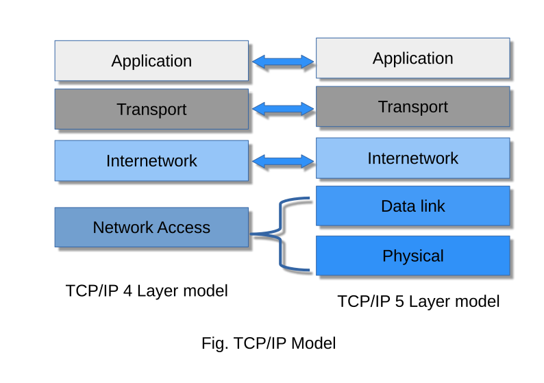

# Protocol layering 

A protocol defines the rules that both send and reciever and all intermediate devices need to follow for effective communication. 

For complex communication we divide the task between different layers, which need a different protocol at each layer. This is known as protocol layering.

Each layer exist on both the sending and recieving host. A specific layer on one machine send/receievs exactly the same object/data that another machine's peer process sends/receives.

Each upper level protocol is supported by the services provided by one or more lower layer protocols

Each layer acts in parallel on both the sending and receving host.

There are two most commonly used protocol stack:-

### TCP/IP Protocol Suite (TCP/IP model)

TCP/IP (Transmission Conrol Protocl/ Internet Protocol) is protocol stack, and is widely used model in internet today. The original TCP/IP model has 4 layers, but recent changes made it a 5 layer.

**Application layer** :- The application layer is the highest layer of the model. This layer defines standard Internet services and network application that user can interact. These services work with transport layer to send and recieve data. This layer includes protocols such as: 

1. SMTP (Simple Mail Transfer Protocol) used to send e-mails.
2. HTTP/HTTPS (Hyper Text Tranfer Protocol/Secure) used to access web.
3. FTP (File Tranfer Protocol) used to transmit file from one system to another.
4. SSH (Secure Shell) used to securely access remote computers over internet.

**Transport Layer** :- It established an error free and reliable data connection between the application or sender and reciever. The data is divide into smaller units i.e., packets, and number them in a sequence. 
This layer determine, the size, destination and transmission rate of data.

Mainly two type of protocols are used in this layer:

1. Transmission Control Protocol (TCP) : It is a connection oriented protocol i.e, it establishes an end-to-end connection with process known as "handshake". It is used for reliable and guaranteed data transfer.

2. User Datagram Protocol (UDP) : It does not establish a connection between sender and reciever i.e, a connectionless protocol. Due to its connectionless nature application that sends small data used UDP, for fast tranmission.

**Internetwork Layer** :- Also known as internet layer or network layer is responsible for receiving and delivering the data packets as accurately as possible for the network. The Protocols used in this layer are:

1. Internet protocol version 4 & 6  (IPv4 & IPv6) : Used ofr routing data across the network, it is responsible to deliver packet from source to destination using Internet Protocl (IP) address.

2. Address Resolution protocol (ARP) : Used to find enthernet address or physical address of host using known IP address.

3. Internet Control Messaging Protocol (ICMP) : It detects and report the errors information generated during tranmission.

**Data Link Layer (DLL)** :- It defines the format of data on the network, it is resposible for unique identification of each device on the network using MAC address.

it has two sub-layer 
 - - Logical link layer - it control synchronization, mulitplexing, error checking and correction function, and flow control of the Data link layer.

 - - Medium access control layer - It is defined as an identification number of a network hardware. It is the link between the logical link contol layer and network's physical layer, it uses CSMA protocol (CSMA/CD, CSMA/CA) for transferring data pakets over network. 

### OSI/ISO Reference Model