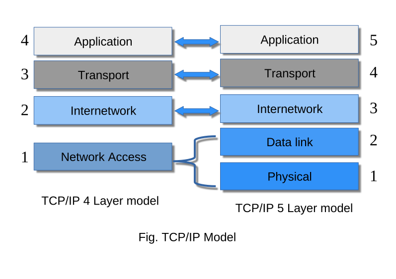

# Protocol layering 

A protocol defines the rules that both send and reciever and all intermediate devices need to follow for effective communication. 

For complex communication we divide the task between different layers, which need a different protocol at each layer. This is known as protocol layering.

Each layer exist on both the sending and recieving host. A specific layer on one machine send/receievs exactly the same object/data that another machine's peer process sends/receives.

Each upper level protocol is supported by the services provided by one or more lower layer protocols

Each layer acts in parallel on both the sending and receving host.

There are two most commonly used protocol stack:-

### TCP/IP Protocol Suite (TCP/IP model)

TCP/IP (Transmission Conrol Protocl/ Internet Protocol) is protocol stack, and is widely used model in internet today. The original TCP/IP model has 4 layers, but recent changes made it a 5 layer. The most common is 5 layer tcp/ip model.

### OSI/ISO Reference Model 

Open System Interconnection or OSI model is designed by the Organisation for International Standards (ISO) in 1984, it also used structured layer like TCP/IP model, and all the TCP/IP layer have the same function in OSI model as well.

The OSI model just have 2 extra layer Presentation and Session layer.

### TCP/IP & OSI/ISO Layers

**Physical (Layer 1)** :- It the the lowest layer in the osi reference model. It refers to the physical tranmission medium through with the data is tranmitted in form of bits e.g, fiber optics, twisted coaxial etc.

when signal arrive from another device, this layer transforms the signal into the bits (0s & 1s) and send them to the upper layer i.e, data link layer.

Functions of physical layer:

1. Bit syncronization - The physical layer uses a control clock at bot sender and reciever, to provide synchronisation at bit level.

2. Bit rate - This layer also defines the transmission rate i.e, bit sent per second.

3. Physical topologies - It also specifies in what arrangement the devices are connected.

4. Tranmission mode - Various tranmission mode are also defined by physical layer, i.e, simplex, half-duplex or full duplex.

ex. Hub, reapeter, modems, physical cables etc.

**Data Link Layer (Layer 2)** :- the main function of data link layer is to provide error free tansmission of data in node to node delivery. It is resposible for unique identification of each device on the network using MAC address.

when packet arrive at the network it is responsibility of DLL to transmit it to the Host using its MAC address.

it has two sub-layer -

 - - Logical link layer (LLC)- it control synchronization, mulitplexing, error checking and correction function, and flow control of the Data link layer.

 - - Media access control (MAC)- It is defined as an identification number of a network hardware. It is the link between the logical link contol layer and network's physical layer, it uses CSMA protocol (CSMA/CD, CSMA/CA) for transferring data pakets over network. 

The packet recieved from the network is further divided into frames depending on the frame size of NIC (network interface card). 

DLL also encapsulate the MAC address of sender and reciever at the header of each frame. MAC address of devices are obtained using ARP(Address Resolution Protocol).

(DLL has IP address of the reciver, it'll send the ARP request, saying "who has this ip address" the destination host will reply with its MAC address)

function of data link layer

1. Framing - The DLL tanslates the packets into frames, it also adds the destinatin address.

2. Flow control - It ensures that the source host with high processing speed does not exceed the receiving host, with lower processing speed.

3. Access control - In a multipoint connection DLL is used to determine wich device will have access or communication channel at a given time.

4. Physical addressing - After creating frames, the DLL adds physical addresses (MAC addresses) of the sender and the reciever in the header of each frame.

5. Error control - This layer also provide error control mechenism, in which it detects and transmits lost or damaged frames.

**Internetwork (Layer 3)** :- Also known as internet layer or network layer is responsible for receiving and delivering the data packets as accurately as possible for the network. The Protocols used in this layer are:

1. Internet protocol version 4 & 6  (IPv4 & IPv6) : Used ofr routing data across the network, it is responsible to deliver packet from source to destination using Internet Protocl (IP) address.

2. Address Resolution protocol (ARP) : Used to find enthernet address or physical address of host using known IP address.

3. Internet Control Messaging Protocol (ICMP) : It detects and report the errors information generated during tranmission.

**Transport (Layer 4)** :- It established an error free and reliable data connection between the application or sender and reciever. The data is divide into smaller units i.e., packets, and number them in a sequence. 
This layer determine, the size, destination and transmission rate of data.

This layer also providd the acknowledgement of the successful data tranmission and re-tranmits the data if a an error is found.

Mainly two type of protocols are used in this layer:

1. Transmission Control Protocol (TCP) : It is a connection oriented protocol i.e, it establishes an end-to-end connection with process known as "handshake". It is used for reliable and guaranteed data transfer.

2. User Datagram Protocol (UDP) : It does not establish a connection between sender and reciever i.e, a connectionless protocol. Due to its connectionless nature application that sends small data used UDP, for fast tranmission.

**Session (Layer 5)** :-

**Presentation (Layer 6)** :- It is also known as translation layer, the data from the application layer

     
**Application (Layer 7)** :- The application layer is the highest layer of the model. This layer defines standard Internet services and network application that user can interact. These services work with transport layer to send and receieve data. This layer includes protocols such as: 

1. SMTP (Simple Mail Transfer Protocol) used to send e-mails.
2. HTTP/HTTPS (Hyper Text Tranfer Protocol/Secure) used to access web.
3. FTP (File Tranfer Protocol) used to transmit file from one system to another.
4. SSH (Secure Shell) used to securely access remote computers over internet.