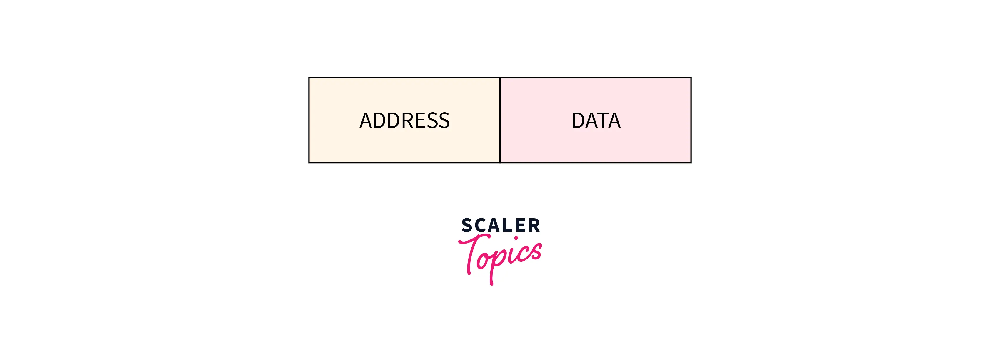

# **Mulitplexing**

Multiplexing is a channel sharing technique used to combine multiple signals into a single complex signal to send over a single physical media. And seperate those complex signals for reciever. There are mainly two devices used:

Mutiplexer (MUX): Multiplexer combine all signals into a single complex signal following many-to-one approach.

Demultiplexer (DEMUX): Demultiplexer is where all the signals are brought bakc to its original state, after removing unwanted transmission data. it uses one-to-many approach.

*Types of multiplexing*

## *Frequency Division Mulitplexing (FDM):*

Frequncy Division Mulitplexing (FDM) is used with analog and digital systems, mainly in digital system in modern communication systems. it divides the available channel bandwidth into several bands. All signals are tranmitted at the same time but are allocated a separate frequency band. 

Each frequency band is separated by a suitable gap as to avoid overlaping. This gap frequency is known as gaurd band.

FDM are mostly used in telecommunication and networking where multiple data streams has to be transmitted simultaneously without interfering with each other (e.g FM radio).

## *Wavelength Division Multiplexing (WDM)*

It is used in analog and digital systems.

Wavelength Division Multiplexing (WDM) is primarily used in fiber optics communication. It combines multiple optical signals, each at a different wavelength, onto a single fibre for transmission. The optical signals are separated into different wavelength using devices like gratings, (arrayed waveguide grating)AWG, thin film filter etc. This increases the transmission capacity on a single fiber compared to a single wavelength.

## *Time Division Muliplexing (TDM):* 

Time Division Mulitplexing (TDM) works with digital as well as analog signals, mainly with digital signals. It divides the available total time on the channel into discrete time slots. Each time slot is allocated to a different signal or data stream to be transmitted. This allows multiple signals to share the same carrier frequency but at different time intervals.

In TDM data is not transmitted simultaneously but rather, transmitted at an interval of specified time slot.

These time slots are orgnized in the form of frames. Frames are cyclic data block, that has fixed time slots.

### **Type of TDM**

* **Synchronous TDM (STDM)-**

In Synchromous Time Division Mulitplexing (STDM) all devices has preassigned time slot whether the device has data or not. If device does not have any data at the specified time, then empty slot will tranmitted at the alloted time slot. 

It creates frames with empty time slots.

If there are n devices there are n slots.

* **Asynchronous TDM (ATDM) -** 

Asynchronour Time Division Multiplexing (ATDM) dynamically allocates the time slots to the devices. That is Time slots are only assigned to devices which have data to tansmit. Which provides more flexibility compared to STDM.

Each Time slot contains address of sender and data.

This dynamic allocation helps in better utilization of time slots, which lowers the transmission time and also provides efficient utilization of capacity of channel. Hence, It does not creates frames with empty slots.

if there are n devices there are m time slots, where m is less than n (m < n). (i.e, if there are are more devices n than the time slots m, ATDM will still perform efficienty (m < n), due to its dyanamic allocation)

## *Code Dvision Multiplexing (CDM)*

Code Division Mulitplexing (CDM) allows multiple users to share the same frequency band simultaneously. It achives this by assigning each user a unique pseudo-random code sequence aka chip that modulate their signals. This signal is spread over a wider bandwidth called the pseudo-noise band using a proces known as spread spectrum communication (where information is spread over a wider bandwidth).

Since the signals are modulated using different sequence codes they do not overlap significantly, which minimize interference between users sharing the same frequency band.

These modulated signal appear like noise to unauthorised user due to random nature of code sequences and signal spreading, which enhances its security.

It is used in Wi-fi, GPS, cellular netwoks(3G) etc.

## *Orthogonal Frequency Division Multiplexing (OFDM)*

OFDM divides the available bandwidth of the physical channel into multiple narrow subcarriers. These subcarries are spaced apart at specific frequncies to avoid overlapping and interference with each other (like dividng a highway into multiple lanes for different traffic flows).

The subcarries are chosen to be orthogonal to each other. This means that the signal of one subcarrier does not interfere with the signal from other subcarrier.

Each subcarrier transmit a single bit in parallel with other subcarriers, enabling transmission of multiple bit simultaneously at different frequencies. 

This contributes to high data speeds like in 4g and 5g networks.

## **Space Division Multiplexing (SDM)**

Space Division Multiplexing (SDM) physically divides the tansmission medium into multiple independent channels by utilizing spatial diamensions (i.e, SDM create new physical independent channel within the existing physical medium, and does not divide the existing signals but distributes them ont these independent channels).

Each independent channel can operate TDM or FDM techniques as per requirements.

-----------------------

# Switching

Switching is the process for transmission of data packets or data stream from a source to their intended destination in a network. Switching utilizes hardware known as nodes.

These node are interconnected in network's. such as router, link layer switches etc.

Some switching methods uses a universal 3-phase protocol for transmission (like circuit switching). But modern switching methods like packet switchig does not use 3-phase protocol.

3-phase protocol

1. Setup connection phase
2. Data transfer phase
3. Tear Down phase

A/B are sender/receiver respecitvely, and 1/2 are nodes. 

call request and call accept (signaling packets) are used to establish a connnection between the sender and reciever.

after connection is established data is tranferred, after transmission of data. An acknowledgement signal is sent by the reciever that conforms that the data has been recieved. 

A clear signal is then sent for the termination of connection, if sender does not want to send any more data.

## Type of switching

### 1. Circuit Switching 

circuit switching has a dedicated physical path between sender and reciever, until the connection is terminated. similar to a telephone network.

Circuit switching uses 3-phases protocol

1. Circuit establishment (setup)
2. Transmission (data transfer)
3. Circuit termination (tear down)

Connection is established using signaling protocols, the request is sent by the sender and reciever replies with an acknowledgement ensuring a dedicated path. After path is established data tranfer begins, until the user terminates the connection.

It uses the whole bandwidth of the physical medium, hence it has fixed bandwidth. 

Due to reserved resources no other data can be transferred even if the channel is free, hence resources are wasted when idle.

*formula for circuit switching:*

Transmission rate = Link Rate or Bit rate / no. of slot = R/h bps

Transmission time = size of file / transmission rate = x / (R/h) = (x*h)/R second

Total time to send packet to destination = Transmission time + circuit setup time = (x*h)/R + k sec

(R = transmission rate of medium, h = no. of slots, x= data size, k= circuit setup time)

### 2. Packet switching

Data is divided into smaller units known as packets, each packet contains some information in its header (such as source address, destination address, sequence numbers etc). These packets travel across the network taking shortest path as possible.

More than one path is possible between sender and reciever. If there is congestion on any path then packets are allowed to take different path possible over the exitsting network.

Once all packets reached the destination then acknowledgement message will be sent by reciever to sender to conforms the data transfer.

Packet switching uses store and forward technique. 

-------------

**There are two types of packet switching technique**

- Virtual Circuit Switching

it is also known a connection-oriented packet switching

In virtual circuit swtiching a locgical route is established using signaling protocols (call request and call accept) between sender and reciever. This logical route can be changed depending on network issues or congestion.

It establishes connection like circuit switching but sends data like packet switching, this dynamic approach makes it less suseptible to congestion.

It also has 3 phase protocol:

1. route establishement (setup) 
2. transmission (data tranfer) 
3. route termination (tear-down) 

Four user are connected in a network, User A sends data to User D using a defined route i.e., User A - S1 - S2 - S3 - User D.

These intermediate nodes are provided with and unique cirtcuit ID's, and data is bound to these unique circuit ID's and could not choose another route, unless there is delay or congestions.

* Datagram packet switching

it is also known as a connectionless packet switching.

Each packet/datagram contains all necessary addressing information such as source address, destination address, port number, sequence number etc. Thus each packet is treated as separate entity. 

It does not have predefined routes like virtual circuit, rather intermidiate nodes take the routing decisions to forward packets based on destination address. This dynamic approach results in an out of order packets delivery. Hence additional protocols must be configured by end-system for guaranteed and reliabe delivery (e.g TCP). This switching type does not involve setup, data tranfer, and teardown phase.

Four user are connected with switch-network, data is tranferred from USER A to USER D. There are two datagram packets a & b. Both take different routes depending on delay time and congestion on network to reach USER D.

packet a:
USER A - S1 - S4 - S3 - USER D

packet b:
USER A - S1 - S5 - S3 - USER D

-----------

Difference between datagram switching and virtual circuit swtiching

Datagram switching | Virtual circuit switching
------------------|-------------------------
Connectionless switching | Connection oriented switching
node make routing decisions for each packet | Node make decision based on the logical connection(virtual circuit)
packets can be delayed or out of order at reciever's end due to congestion of nodes | it is less suseptible to congestion due to the virtual logical connection 
very flexible due to its dynamic nature, but additional protocol at reciever is needed for reliable data delivery | Offers less flexibilty but provide guaranteed order and error correction, due to established logical connection.

----------

Packet switching | Circuit switching
-----------------|------------------
data is divided into smaller units called packets | data is not divided, rather a circuit is setup between sender and reciever which acts as a physical route.
Packets are processed at every node for desitnation address | data flows directly from source to destinaton, due to predefined route.
Requires additional protocol (TCP) for reliable delivery, as packets can be out of order | it is more reliable and provides guanranteed delivery of data stream.
Intermidiate nodes take routing dicisions | route is already predefined at source.
it does not have a predefined physical path | it has a dedicated path.
it is less expensive due to their shared resources | it is more expensive due to dedicated resources.
It can easily be scaled according to the network conditions and adapt to the traffic pattern. | Due to its physical nature, it is expensive to upgrade.
It has higher latency | It has lower latency.

-------

### 3. Message Switching

Message switching was developed as an alternative to circuit switching before the packet switching was introduced. It is a connectionless switching technique, where entire message is routed from source to destinaton using hop-by-hop-system.

Entire information inculding the desitnation address in its header is wrapped into a single data unit known as message and transferred to receiver as a "message". Each message is treated as an independent entity by intermediate nodes. Hence it is transferred as a complete unit. 

it utilizes store and forward techniqe, i.e., each message is stored in its entirety before forwarding to another node. Message switching provides dynamic routing of message. 

